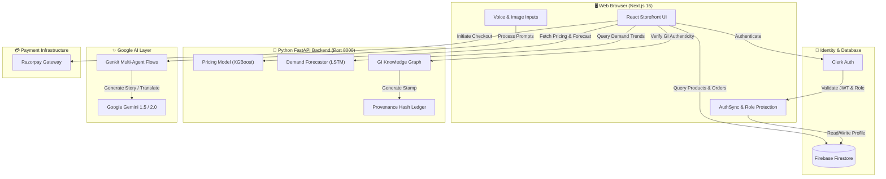

<div align="center">

  <h1>🪔 Viraasat 2.0 (विरासत)</h1>
  <h3><i>Preserving Heritage. Empowering Artisans. Inspiring the World.</i></h3>

  <p>
    An end-to-end, AI-powered digital marketplace & trust layer connecting India’s master artisans directly with global buyers.
  </p>

  <p>
    <a href="#-key-features"></a>
    <a href="#-tech-stack"></a>
    <a href="#-tech-stack"></a>
    <a href="#-tech-stack"></a>
    <a href="#-tech-stack"></a>
    <a href="#-tech-stack"></a>
    <a href="#-tech-stack"></a>
  </p>

  <br />

  [Explore Features](#-key-features) •
  [How It Works](#-how-it-works-for-everyone) •
  [System Architecture](#-system-architecture) •
  [Quick Start](#-quick-start-guide) •
  [Project Structure](#-project-structure)

</div>

---

## 🌟 What is Viraasat 2.0?

**Viraasat** (*Hindi for "Heritage"*) is an intelligent e-commerce ecosystem built to bridge the gap between traditional Indian master artisans and connoisseurs worldwide. 

In traditional markets, rural artisans lose up to **70% of their earnings to middlemen** because they lack digital tools, photography skills, or English language fluency. **Viraasat 2.0** turns any smartphone into a **high-tech business studio**:

* 🎙️ **Artisans simply speak** in their native language—our AI writes rich, cultural product narratives.
* 📷 **Artisans snap a photo**—computer vision automatically categorizes raw materials and detects craft origins.
* 💰 **AI pricing algorithms** calculate fair prices based on labor hours and material costs, ensuring artisans are paid what they truly deserve.
* 🛡️ **Buyers receive digital certificates of authenticity** backed by a Geographical Indication (GI) Knowledge Graph and blockchain provenance ledger.

> [!NOTE]  
> **Real-World Impact**: 2,900+ rural families empowered across Rajasthan, Kashmir, Kutch, and Bihar, delivering a **1.95x income multiplier** compared to traditional middleman baselines.

---

## 📉 The Problem vs. 💡 The Viraasat Solution

| Traditional Challenge 🛑 | Impact on Artisans ⚠️ | Viraasat 2.0 AI Solution 🚀 |
| :--- | :--- | :--- |
| **Low-Quality Mobile Photos** | Buyers scroll past dim or cluttered photos. | **Computer Vision Scan & AI Enhancement**: Auto-crops, fixes lighting, and tags craft attributes instantly. |
| **Language & Writing Barrier** | Artisans struggle to write detailed English listings. | **Voice-to-Text & AI Storytelling**: Speaks local language; AI generates SEO-optimized, culturally rich stories. |
| **Arbitrary Middleman Pricing** | Artisans are underpaid for hundreds of hours of labor. | **AI Pricing Engine**: Calculates fair labor + material cost multiplier to recommend optimal market prices. |
| **Unpredictable Sales Seasons** | Stock sits unsold or sells out prematurely. | **12-Month Demand Forecasting**: ML algorithms alert artisans to upcoming festival demand & raw material costs. |
| **Counterfeit & Fake Products** | Buyers doubt if items are authentic handcrafted goods. | **GI Knowledge Graph & Provenance**: Generates digital authenticity passports verified against certified craft registries. |

---

## 👥 Dual-Role Experience

Viraasat 2.0 provides dedicated, tailored interfaces for both sides of the marketplace:

```
                          ┌──────────────────────────┐
                          │   Clerk Authentication   │
                          └────────────┬─────────────┘
                                       │
                         ┌─────────────┴─────────────┐
                         ▼                           ▼
              ┌─────────────────────┐     ┌─────────────────────┐
              │    BUYER PORTAL     │     │   ARTISAN PORTAL    │
              │  "Discover Craft"   │     │   "Grow Business"   │
              └──────────┬──────────┘     └──────────┬──────────┘
                         │                           │
  ┌──────────────────────┴───────┐   ┌───────────────┴──────────────┐
  │ • Curated Shop               │   │ • Product Studio & Vision    │
  │ • Multi-Agent AI Assistant   │   │ • AI Price Predictor         │
  │ • Wishlist & Shopping Cart   │   │ • 12-Month Demand Forecast   │
  │ • Razorpay Secure Checkout   │   │ • Workshop Fulfillment Queue │
  │ • Order Tracking & GI Ledger │   │ • GI Provenance Certificates │
  └──────────────────────────────┘   └──────────────────────────────┘
```

### 🎨 1. For Artisans (The Business Studio)
* **`/artisan/dashboard`**: Central control panel showing active creations, revenue stats, and live fulfillment status.
* **`/artisan/products/new`**: Add new items using voice input, AI image vision scans, and AI pricing recommendations.
* **`/artisan/ai-tools`**: Suite containing AI Description Generator, Multilingual Translator (14+ languages), and Image Cultural Story Finder.
* **`/artisan/business-advisor`**: Predictive 12-month demand curve mapped against regional festival spikes and tourist inflows.
* **`/artisan/provenance`**: GI Registry certificates and immutable block hash records.

### 🛍️ 2. For Buyers (The Connoisseur Marketplace)
* **`/dashboard`**: Buyer Hub with order tracking, saved wishlist summaries, and fair-trade impact reports.
* **`/shop`**: High-performance marketplace with search, category filtering, and high-res previews.
* **`/wishlist` & `/cart`**: One-click saved items, quantity management, and persistent cart storage.
* **`/checkout`**: Smooth payment integration powered by Razorpay.
* **AI Heritage Assistant**: Interactive conversational guide powered by Google Gemini and Genkit multi-agent architecture.

---

## 🛠 Tech Stack

Viraasat 2.0 combines modern web frameworks, cloud infrastructure, and artificial intelligence into a fast, reliable architecture:

### Frontend (User Interface)
* **Next.js 16 (App Router)**: Fast, server-side rendered storefront.
* **TypeScript**: Type-safe codebase ensuring zero runtime crashes.
* **Tailwind CSS & Shadcn UI**: Modern design system with responsive dark/light mode themes.
* **Lucide Icons & Recharts**: Elegant icons and interactive analytics charts.

### Backend & Cloud Services
* **Python 3.11 & FastAPI**: High-performance backend microservices for pricing & demand forecasting engines.
* **Clerk Authentication**: Enterprise-grade identity management with role-based routing.
* **Firebase Cloud Firestore**: Real-time NoSQL database for products, users, and orders.
* **Razorpay Payment Gateway**: Secure transactions supporting UPI, Cards, NetBanking, and Wallets.

### Artificial Intelligence & Trust Layer
* **Google Gemini & Genkit**: Conversational multi-agent assistant for cultural stories & recommendations.
* **Computer Vision API**: Automated craft classification, tag extraction, and material detection.
* **Scikit-Learn & XGBoost**: Machine learning regression models for dynamic price estimation and demand forecasting.
* **GI Knowledge Graph & Provenance Ledger**: Semantic graph database mapping certified craft origins.

---

## 🏗 System Architecture

The following diagram illustrates how the Next.js frontend, Python FastAPI microservices, Firebase database, and Google AI engines interact:



---

## ⚙️ Quick Start Guide

You can launch the entire Viraasat 2.0 ecosystem locally in **under 2 minutes**.

### Prerequisites
* **Node.js**: v18.0.0 or higher
* **Python**: v3.9 or higher
* **Git**: Installed on your system

---

### 🚀 1-Command Startup (Recommended)

Clone the repository and run the automated launcher script:

```bash
# 1. Clone the repository
git clone https://github.com/Aayush9-spec/viraasat.git
cd viraasat

# 2. Grant execution permission and launch both Frontend & Backend
chmod +x run_all_viraasat.sh
./run_all_viraasat.sh
```

> [!TIP]  
> `./run_all_viraasat.sh` automatically installs Node modules, sets up Python virtual environments, and starts the **Next.js Frontend on Port 9002** and **Python FastAPI Backend on Port 8000** simultaneously!

---

### 🛠️ Manual Step-by-Step Setup

If you prefer to start services individually:

#### Step 1: Start Python Backend (Port 8000)
```bash
cd backend
python3 -m venv venv
source venv/bin/activate   # On Windows: venv\Scripts\activate
pip install -r requirements.txt
python main.py
```

#### Step 2: Start Next.js Frontend (Port 9002)
```bash
cd frontend
npm install
npm run dev
```

Open your browser and visit:
* **Frontend Storefront**: [http://localhost:9002](http://localhost:9002)
* **Backend API Docs (Swagger UI)**: [http://localhost:8000/docs](http://localhost:8000/docs)

---

## 🔑 Environment Configuration

Create a `.env.local` file inside the `frontend/` directory with your API credentials:

```env
# Clerk Authentication Keys
NEXT_PUBLIC_CLERK_PUBLISHABLE_KEY=pk_test_...
CLERK_SECRET_KEY=sk_test_...

# Google AI & Gemini Key
GEMINI_API_KEY=AIzaSy...

# Firebase Firestore Configuration
NEXT_PUBLIC_FIREBASE_API_KEY=AIzaSy...
NEXT_PUBLIC_FIREBASE_AUTH_DOMAIN=your-app.firebaseapp.com
NEXT_PUBLIC_FIREBASE_PROJECT_ID=your-project-id
NEXT_PUBLIC_FIREBASE_STORAGE_BUCKET=your-app.appspot.com
NEXT_PUBLIC_FIREBASE_MESSAGING_SENDER_ID=123456789
NEXT_PUBLIC_FIREBASE_APP_ID=1:123456789:web:...

# Backend Gateway URL
NEXT_PUBLIC_BACKEND_URL=http://localhost:8000
```

---

## 📂 Project Structure

```
viraasat/
├── frontend/                        # 🌐 Next.js 16 Web Application
│   ├── src/
│   │   ├── app/                     # App Router Pages & Layouts
│   │   │   ├── artisan/             # 🎨 Artisan Studio Routes (Dashboard, Products, AI Tools, etc.)
│   │   │   ├── dashboard/           # 🛍️ Buyer Dashboard & Profile
│   │   │   ├── select-role/         # Role Selection Screen
│   │   │   ├── shop/                # Marketplace Listing
│   │   │   ├── product/[id]/        # Product Detail Page
│   │   │   ├── wishlist/            # Saved Items Wishlist
│   │   │   ├── checkout/            # Razorpay Checkout
│   │   │   ├── login/ & signup/     # Clerk Auth Views
│   │   │   └── layout.tsx           # Global Root Layout & AuthSync
│   │   │
│   │   ├── components/              # Reusable UI Components
│   │   │   ├── auth/                # RoleSelector & ProtectedRoute
│   │   │   ├── ui/                  # Buttons, Cards, Dialogs, Tables
│   │   │   ├── artisan-nav.tsx      # Artisan Sidebar Navigation
│   │   │   └── main-content.tsx     # Dynamic Role Header Navigation
│   │   │
│   │   ├── lib/                     # Auth & Database Utilities
│   │   │   ├── auth/                # get-current-user, get-user-role, require-role
│   │   │   └── firebase/            # client.ts & users.ts Firestore CRUD
│   │   │
│   │   ├── features/                # Scoped Domain Logic (Artisan, AI, Cart, Analytics)
│   │   ├── hooks/                   # React Hooks (use-user-role, use-cart, use-toast)
│   │   └── types/                   # TypeScript Type Definitions (user.ts, order.ts, product.ts)
│   │
│   ├── package.json
│   └── next.config.ts
│
├── backend/                         # 🧠 Python FastAPI Microservices
│   ├── app/
│   │   └── api/router.py            # API Route Mappings (predict-price, forecast-demand, etc.)
│   ├── ai/                          # Machine Learning & AI Models
│   │   ├── pricing.py               # XGBoost Price Estimation Engine
│   │   ├── forecasting.py           # LSTM Demand Forecasting Engine
│   │   ├── graph.py                 # GI Knowledge Graph Semantic Search
│   │   └── blockchain.py            # Provenance Hash Generator
│   ├── main.py                      # FastAPI Application Gateway
│   └── requirements.txt
│
├── database/                        # 🗄️ Static Knowledge Graph Data & ML Binaries
├── run_all_viraasat.sh              # 🚀 One-Click Master Startup Script
└── README.md                        # 📖 Project Documentation
```

---

## 🧪 Testing Role-Based Workflows Locally

### 1. Test the Buyer Experience
1. Open [http://localhost:9002/login](http://localhost:9002/login) and sign in.
2. Select **BUYER** on the role selection screen.
3. You will land on the **Buyer Dashboard** (`/dashboard`).
4. Browse products in `/shop`, add items to `/wishlist` or `/cart`, and proceed through `/checkout`.
5. Try manually navigating to `/artisan/dashboard`—notice you are automatically redirected back to your buyer dashboard!

### 2. Test the Artisan Experience
1. Log out and sign up with a new account.
2. Select **ARTISAN** on the role selection screen.
3. You will land on the **Artisan Hub** (`/artisan/dashboard`).
4. Add a product at `/artisan/products/new`, test the Computer Vision scan, and run the AI Price Predictor.
5. Explore 12-month demand forecasts at `/artisan/business-advisor` and GI certificates at `/artisan/provenance`.
6. Try navigating to `/checkout`—notice you are automatically redirected back to your artisan dashboard!

---

## 🤝 Contributing

We welcome contributions from developers, designers, and cultural preservation enthusiasts worldwide!

1. **Fork** the repository.
2. **Create a Feature Branch**: `git checkout -b feature/amazing-feature`
3. **Commit Your Changes**: Follow conventional commit guidelines (`feat:`, `fix:`, `docs:`).
4. **Push to the Branch**: `git push origin feature/amazing-feature`
5. **Open a Pull Request**.

---

## 📄 License

This project is licensed under the **MIT License**. See the [LICENSE](LICENSE) file for details.

---

<div align="center">
  <p><b>Handcrafted stories deserve a global stage. 🌍✨</b></p>
  <p>Built with ❤️ for Indian Master Artisans by <b>Aayush Kumar Singh</b> and Team.</p>
</div>
